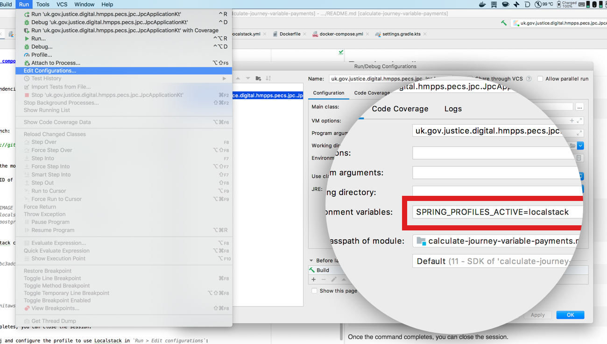

# Calculate Journey Variable Payments

[](https://circleci.com/gh/ministryofjustice/calculate-journey-variable-payments)
[](https://quay.io/repository/hmpps/calculate-journey-variable-payments)
## Prerequisites

- [Docker and Docker compose](https://docs.docker.com/get-docker/)
- [Intellij IDEA](https://www.jetbrains.com/idea/)

## Building

To build (append `-x test` to build without running tests):
```
./gradlew clean build
```

## Running locally

You can run the dependencies for the projects with Docker compose:

```bash
docker-compose up
```

The command will launch:

- [Localstack](https://github.com/localstack/localstack) (which is used to mock Amazon S3)
- Postgres

Next, head over to Intellij and configure the Spring Boot's profile to use Localstack in `Run > Edit configurations`:



You can run the application from Intelli with `Run > Run`.

If you prefer to run the app from the command line, you can do so from the root of the project with:

```bash
./gradlew bootRun --args='--spring.profiles.active=localstack'
```

### Common gradle tasks 
To list project dependencies, run:
```
./gradlew dependencies
```

To check for dependency updates, run:
```
./gradlew dependencyUpdates --warning-mode all
```

To run an OWASP dependency check, run:
```
./gradlew clean dependencyCheckAnalyze --info
```

To upgrade the gradle wrapper version, run:
```
./gradlew wrapper --gradle-version=<VERSION>
```
To automatically update project dependencies, run:
```
./gradlew useLatestVersions
```
