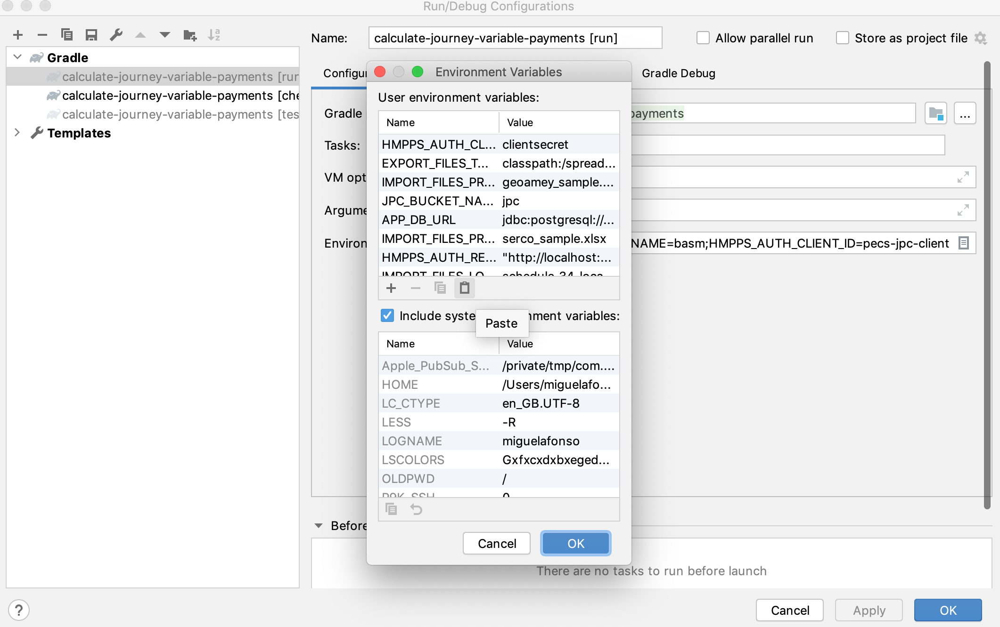

# Calculate Journey Variable Payments

[](https://circleci.com/gh/ministryofjustice/calculate-journey-variable-payments)
[](https://quay.io/repository/hmpps/calculate-journey-variable-payments)
## Prerequisites

- [Docker and Docker compose](https://docs.docker.com/get-docker/)
- [Intellij IDEA](https://www.jetbrains.com/idea/)

## Building

To build (append `-x test` to build without running tests):
```
./gradlew clean build
```

## Running locally

You can run the dependencies for the projects with Docker compose:

```bash
docker-compose up
```

*Note: to log into the application (via the redirect to the HMPPS auth service) your user will need the PECS_JPC role assigned. A hmpps-auth in-memory user has been set up with this role to help with this 'jpc_user'.*

The command will launch:

- [Localstack](https://github.com/localstack/localstack) (which is used to mock Amazon S3)
- Postgres

Next, head over to Intellij and set the environment variables from .env into the Run Configuration `Run > Edit configurations`:



You can run the application from Intelli with `Run > Run`.

If you prefer to run the app from the command line, you can do so from the root of the project with:

```bash
export $(cat .env | xargs)  # If you want to set or update the current shell environment
./gradlew bootRun '
```

### Data for pricing journeys/moves

Pricing data makes its way into the service via two mechanisms. Via a daily CRON job (which at time of writing runs in 
the early hours of the morning) and via a manual process (with the view the manual process will be going away). The 
CRON job is configured in the helm config of this project via the **CRON_IMPORT_REPORTS** environment variable.

The data itself falls into three distinct types:

1. Schedule 34 location data - this represents the allowed contracted locations for moves within Book a Secure Move, in 
   Excel spreadsheet format. Upon receipt of this spreadsheet it is (manually) uploaded to a secure S3 bucket.
2. Supplier pricing data - this represents the agreed prices with the suppliers for moves 'from' and 'to' the schedule 
   34 locations i.e. it is dependent on the Schedule 34 locations, in Excel spreadsheet format. There is a separate 
   pricing spreadsheet for each supplier. Upon receipt of a supplier price spreadsheet it is (manually) uploaded to a 
   secure S3 bucket.
3. Move reporting data - these are JSON files representing all the of the supplier moves, stored in a secure S3 bucket. 
   These files are uploaded automatically to S3 by an independent process not managed by this application.  The files 
   are pulled into the application via the daily early morning CRON job to be used for calculating journey prices. It is
   important to understand that the reports (are always) being pulled based on the previous day.

### Manually importing locations, supplier prices and reporting data

**IMPORTANT:**

- EXTREME CARE SHOULD BE TAKEN WHEN RUNNING LOCATION AND PRICING IMPORTS IN PRODUCTION, EXISTING LOCATIONS AND PRICES 
  WILL BE REMOVED!!
- TO MANUALLY IMPORT DATA IN PRODUCTION YOU WILL NEED TO GO DIRECTLY ONTO ONE OF THE KUBE PODS.
- MANUALLY IMPORTING REPORTING DATA IS MAINLY TO SUPPORT LOADING OF BACK-FILLED SUPPLIER REPORTING DATA. IT CAN BE SLOW, 
  IF YOU HAVE TO IMPORT A LOT OF DATA THEN ALLOW PLENTY OF TIME AND ALSO CONSIDER TIME OF EXECUTION.

Start by running the following from the command line to take you into the Spring shell.

```bash
export $(cat .env | xargs) # Only run this if you want to set or update the current local environment

java -jar app.jar --spring.shell.interactive.enabled=true --spring.main.web-application-type=none
```
Once in the Spring shell the following commands for importing data are available:
```
import-locations
```
```
import-prices --supplier SERCO/GEOAMEY
```
```
import-reports --from YYYY-MM-DD --to YYYY-MM-DD
```
Typing help in the shell will also list the available commands.  TAB autocomplete is also available.

To exit from the shell simply type: exit

### Common gradle tasks 
To list project dependencies, run:
```
./gradlew dependencies
```

To check for dependency updates, run:
```
./gradlew dependencyUpdates --warning-mode all
```

To run an OWASP dependency check, run:
```
./gradlew clean dependencyCheckAnalyze --info
```

To upgrade the gradle wrapper version, run:
```
./gradlew wrapper --gradle-version=<VERSION>
```
To automatically update project dependencies, run:
```
./gradlew useLatestVersions
```
